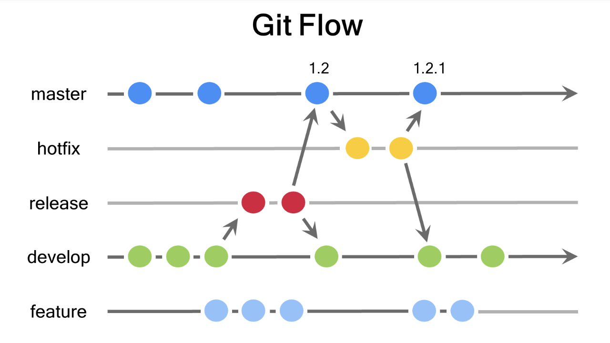
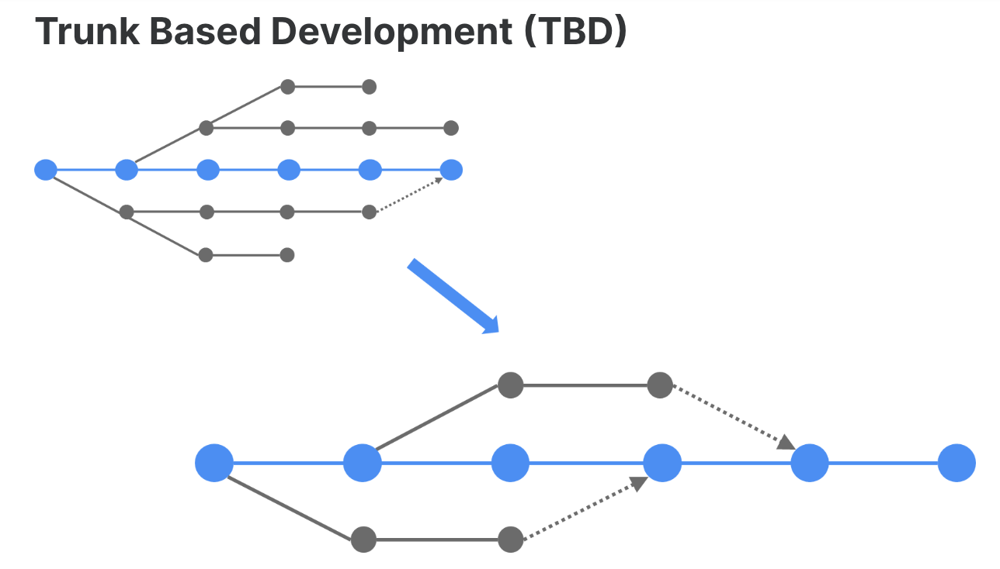
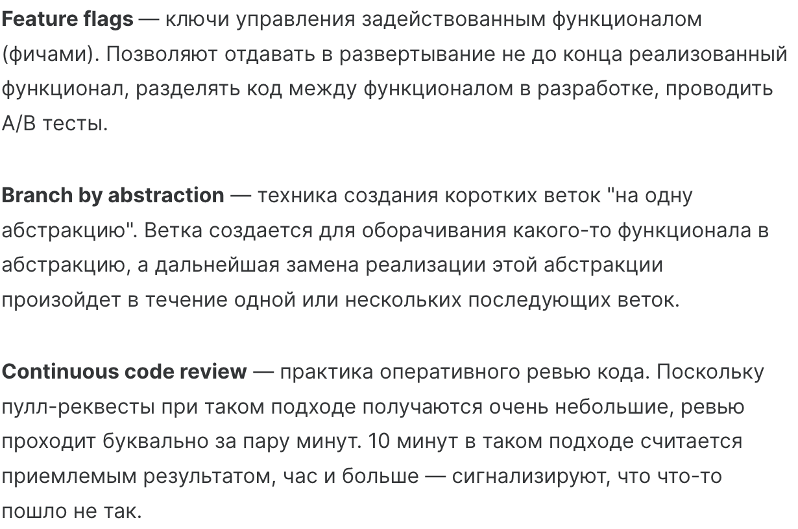

# Подготовка рабочей среды

## virtualenv

Иногда нужно для работы с разными проектами использовать разные 
версии библиотек, или даже разные версии python.
Для этого нужно использовать виртуальное окружение

Устанавливаем virtualenv - инструмент для работы с окружениями

1. `pip install vitrualenv`

2. создаем `virtualenv sandbox`

    В данном случае `sandbox` это название окружения, его можно изменить

3. Активируем виртуальное окружение
    `source sandbox/bin/activate`
4. После этого у нас в терминале показывается название виртуального окружения. 
   
   Используется интерпретатор python, который находится внутри папки с названием `sandbox` и все библиотеки устанавливаются для работы с этим же интерпретатором

5. Для деактивации виртуального окружения используем команду `deactivate`

## poetry

Есть аналогичный инструмент для работы с виртуальными окружениями - poetry
Это более мощный инструмент, который сам может решать конфликты зависимостей библиотек. При этом не нужно создавать виртуальное окружение. 
1. Для установки используется pip ...

`pip install poetry`

2. Для начала работы запускаем в текущем проекте `poetry init`. Нужно ввести всю необходимую информацию о проекте, после чего poetry создаст файл `pyproject.toml` со всей необходимой информацией

3. Чтобы посмотреть структуру пакетов в проекте: `poetry show --tree`

4. Чтобы создать новый проект: `poetry new sandbox`

5. Если вы разоварачиваете проект в другом месте, нужно выпоолнить `poetry install`. После этого будут установлены все зависимости, указанные в файле toml

6. `poetry update` - обновить все версии библиотек

7. `poetry add <название пакета>` добавить пакет в зависимости
    Например: `poetry add "django>=2"`
8. `poetry remove django` - удалить пакет django

9. `poetry run <python_file>` - запустить файл под "патронажем" poetry. 

## Система контроля версий

### Существуют разные стратегии ветвления в системе контроля версий. Сама известная из них - gitflow

Существуют несколько веток, каждая из которых выполняет свои функции.

- master - в этой ветке находится готовый и протестированный код

- develop - для разработки. От нее мы наследуем другие рабочие ветки, в которых ведется разработка

- release - для того, чтобы передать код заказчику, после чего изменения заливаются обратно в develop и в master(main)

- hotfix - для исправления критических ошибок

Помимо этого, существуют `github flow`, `gitlab flow`

### github flow

Существует только одна основная ветка - master ( сейчас это main), которая используется для деплоя, и остальные ветки ветвятся от нее, а потом заливаются в нее же

### gitlab flow

Похоже на предыдущую, однако ветка master не является конечной, от нее код пойдет дальше - на тестирование в ветках staging, pre-production, а затем в production

## Trunk based development

Есть основаная ветка master, от которой ненадолго(не более 24 часов) наследуются другие ветки, которые заливаются обратно в master. Ветка master всегда готова к релизу(деплою). Это дисциплинирует, заставляет максимально обдумывать и декомпозировать задачи, делать частые коммиты, проводить синхронное код-ревью

## Pre commit hooks

Для проверки кода перед отправкой его в основной репозиторий, можно добавить проверки(хуки), которые будут выполняться автоматически при определенных действиях. Например - перед созданием коммита

`pip install pre-commit` - устанавливаем утилиту

`pre-commit sample-config > .pre-commit-config.yaml` добавляем файл, чтобы не писать его самим

`pre-commit install` - хуки будут добавлены в .git

`pre-commit run --all-files` - запускаем проверки на все файлы 