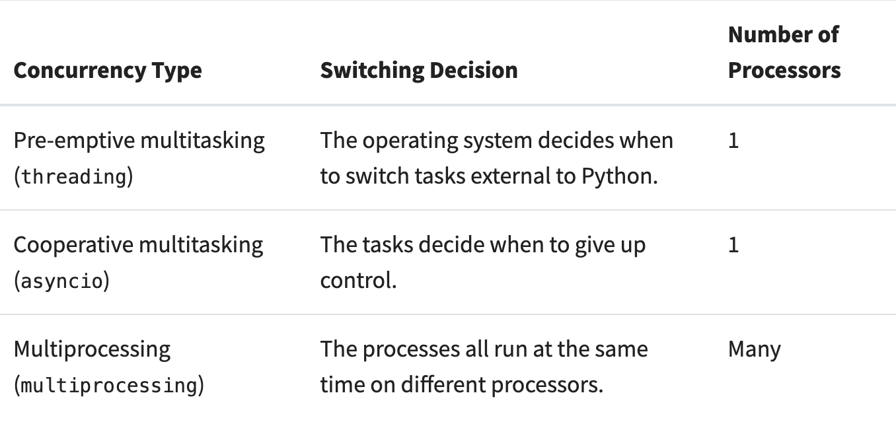
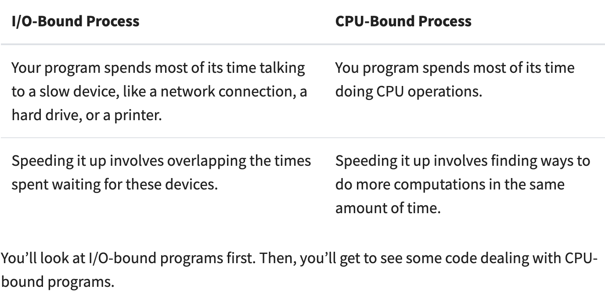

# Паралелизм в Python

Список литературы:

1. https://realpython.com/python-concurrency/

2. https://habr.com/ru/companies/otus/articles/769448/
3. https://docs.google.com/document/d/18CXhDb1ygxg-YXNBJNzfzZsDFosB5e6BfnXLlejd9l0/edit#heading=h.kcngwrty1lv
4. https://realpython.com/python-gil/
5. https://wiki.python.org/moin/GlobalInterpreterLock

## wothout concurrency

simple code in "without_threading.py" run in 20.59 seconds

## Threading

4.237 seconds

## asyncio

`pip install aiohttp`

2.03 seconds

