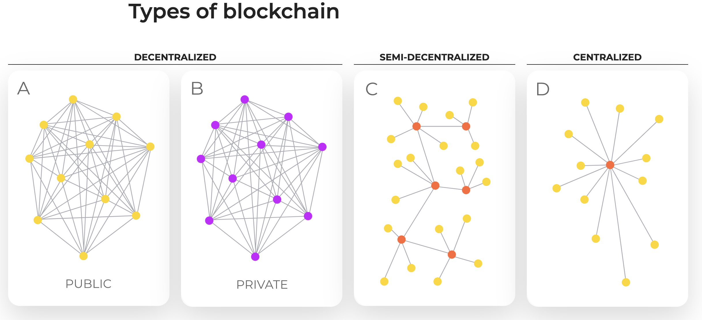

# B

Blockchain — continuous chain of blocks that stores information about the actions of users on the network. Each block contains information about the operations carried out at the present time and performed earlier. We can say that blocks are digital notebooks for reporting on operations performed.

The block consists of a header and a list of transactions.

The block header includes its hash (identification number consisting of alphanumeric characters), the hash of the previous block, transaction hashes and additional service information. Сhanges in one block entail changes in all subsequent ones, which helps to avoid block substitution.

Transactions — are the process of storing the data of the operation performed, during which cryptographic assets or any other information is transferred between crypto wallets. Confirmed transactions are combined into blocks

It is impossible to change or disrupt the sequence of blocks, only new blocks are added to the network, and information about each is always stored in the system.

The main advantages of blockchain in comparison with alternative systems is the possibility of complete decentralization, which makes the network secure, anonymous and profitable. In a decentralized blockchain, there is no single central governing body, and the corresponding responsibilities are distributed across all network users, regardless of their geographic location. Every action of every user is recorded in a block, which is formed by a randomly selected miner, and then checked and confirmed by all other miners.There can be 10, 20, 30 and more thousand of them in large blockchains. The probability of block substitution in such a system becomes impossible, and modern encryption methods equally ensure anonymity and protect the system from hacking.

## start

The idea of blockchain technology originated in 1991 and was introduced by Stuart Haber and Scott Stornett in order to prevent the possibility of forging document timestamps. They experimented with storing files on a cryptographically secured blockchain and tried to organize those blocks. At that time this technology did not achieve much success, and the development was suspended.

The existing form of a blockchain appeared only in 2008, when it`s development was started by Satoshi Nakamoto (it is unknown whether he was an individual developer or a group of people under one pseudonym). Then the idea arose to develop a peer-to-peer (when all participants have equal rights) decentralized system of digital money — Bitcoin, based on a blockchain technology.

It was only the beginning of a huge and all-encompassing world of cryptocurrencies. Soon we will tell you what modern decentralized technologies have come to in the field of data storage and the security of your assets.

## types

There are several types of blockchain networks. In the terms of privacy, blockchains are divided into:

- Open blockchain — any user, without any restrictions, can become its member.

- Closed blockchain is available to a certain circle of people.
In the terms of decentralization, blockchains are divided into:
Centralized blockchain — with one center that processes transactions and generates blocks.

- Decentralized blockchain — a completely decentralized network where all participants have the same rights.

- Semi-decentralized blockchain — with a number of designated nodes that handle transactions and confirm blocks. In such a network, some users have elevated privileges.

Each type of blockchain has its own characteristics, but the basic principles of operation are the same: chain of blocks, peering (when two internet networks can be connected and have the ability to exchange traffic), consensus mechanism (Proof-of-Work, Proof-of-Stake, Proof-of-Storage will be described in detail further). At the same time, nobody can say that one blockchain is better than the other. Each type of blockchain is used for specific tasks: for example, a closed centralized or semi-decentralized blockchain is most often used for corporate needs, and an open decentralized blockchain will be a priority for global financial structures.

## Sidechain
Sidechain — is a blockchain split method when the user sends their assets to the parallel chain. It is used to exchange different currencies within the same network, and to avoid large commissions. While the commission on large overloaded blockchains can reach up to $600 per operation, the commissions on a sidechain can be less than a cent. The commission of the main blockchain will have to be paid only at the entrance and exit, when, after some number of operations, the user will need to synchronize all his transactions with the main blockchain.

## System vulnerability
Blockchain technology has its drawbacks and complexities associated with the threat of network hacking. In most cases, there are only 2 types of attacks that can be dangerous, which are quite easy to prevent by choosing the right blockchain. One of the most well-known types of attacks is DDoS (Denial of Service) attack, the purpose of which is to crush a system by sending a large number of requests. You can prevent this attack by limiting the number of accepted requests, decreasing the block size and by introducing commissions.The smallest commission, that an ordinary user will not even notice, will become a very strong obstacle for the attacker, because now each attack will cost a lot of money. As a result, even a successful attack becomes meaningless, because it will cost much more than the theoretically possible benefit.

There are also situations when several blocks consider the same block as the previous. This happens due to delays in signal transmission, since miners can be located in completely different parts of the planet. As a result, the chain begins to fork. At the same time, the blocks added to these chains can be either the same or different, that means, they contain different transactions. Remains only one of them — the longest chain that was received and verified by the most miners.Transactions that are not included in this chain go to the unconfirmed section and will be added into the blockchain in the next blocks. This feature of the blockchain can be used by attackers to carry out the so-called 51% attack, in which the attacker gainsa large share of the network's power, which allows him to:

> 51% attack allows attacker to
Prevent other miners from finding blocks, and thereby take all the reward for all blocks, or leave these blocks unconfirmed
Double-spend coins to steal from exchanges, or other service providers
Create a fork of the main blockchain, dividing it into 2 networks

Let's take a closer look at the double spending mechanism. The attacker transfers 1000 coins to the seller. The seller sees that the transaction is confirmed, the money has come to his account, and then sends the goods to the attacker. The attacker carries out a 51% attack and rolls back the blockchain to an earlier state. The seller enters his wallet again and sees that he no longer has these 1000 coins, moreover, there is not even a mention of the transaction. An attacker is able to spend this amount over and over again, which is called a «double spend». In the real world, this cannot happen indefinitely, since the coin, the blockchain of which was attacked, will sharply lose in value, or it may even disappear from the exchangers.

A 51% attack can be carried out with less power. The probability of success is calculated based on the duration of the attack and the amount of computing power of the attacker.

Small blockchains are vulnerable to this attack, where it is easy to take over a large share of the network's computing power. Therefore, it is unreasonable to create a blockchain for each individual project, since it will be vulnerable by default. It is much safer to use existing large blockchains.

## Let's summarize everything that we have learned in this block

Blockchain is a revolutionary invention of the information technology world. It consists of a chain of blocks, which in turn are records of all actions on the network. Decentralization and modern encryption methods ensure the safety and anonymity of network users. Small blockchains are vulnerable to hacker attacks, so it is worth thinking very carefully before investing your assets in a small blockchain. And, of course, in order not to become a victim of crypto scammers, you need to be well versed in the nuances of the system, so we are glad that you decided to take our course.