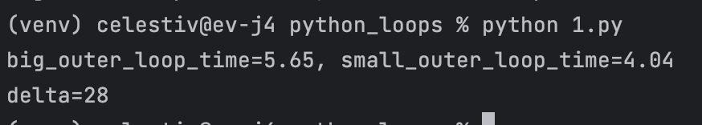
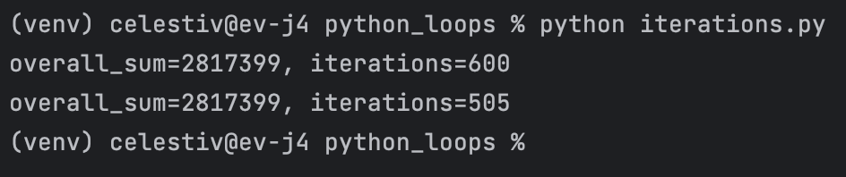
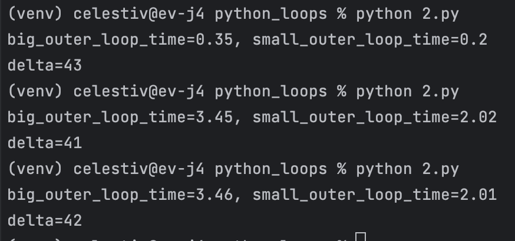

# Сравнение производительности циклов в Python

Навеяно вот этим [видео](https://www.youtube.com/watch?v=aJCp9ptN_aI)

Утверждение в том, что циклы работают быстрее, если внешний цикл меньше
## Первое видео. Простые эксперименты 

### Сравниваем время выполнения кода в циклах

Если запустить две одинаковые функции с вложенными циклами, в одной из них
внешний цикл из 5 итераций, а вложенный из 100 (small_outer_loop),
в другой наоборот, то первая функция работает примерно на 30% быстрее.

Я запустил код и убедился в этом, увидев разницу своими глазами

### Сравниваем количество итераций

Пишем копию кода из предыдущей части, но добавляем счетчик для итераций, которые будут выполнены 
в циклах

Видим, что сумма одинаковая, но количество итераций разное.

### Сравниваем суммирование без таблицы

В первом эксперименте мы создали таблицу с рандомными значениями, и суммировали значения в ней.
Появилась версия, что питон каким-то образом кэширует эти данные, и за счет этого появляется разница в скорости вычислений.
Чтобы проверить это, переписываем код снова, на этот раз просто делаем +1 к сумме каждый раз, без таблицы.
У Алексея разница вышла такая же, около 30%, а у меня каждый раз выходит delta больше 40%.

## Второе видео

[источник](https://youtu.be/U9b02QW9D2Q?si=csI9C2kW4M5-RSju)

### Используем дизассемблер для питона!

Импортируем модуль [dis](https://docs.python.org/3/library/dis.html)

Запускаем поочередно две наши функции и записываем их вывод в файлы small.dis и big.dis соответственно

Смотрим байт-код и видим как он выполняется. Ничего особенного, обычный запуск циклов, никакой оптимизации на уровне ассемблера

### Создаем свой итератор my_range

Видим, что во время выполнения кода количество повторений различается.

Когда мы выполняем код в цикле 100 раз по 5, он выполняется на самом деле не 500, а 500 + 100 раз, 
так как каждый внешний цикл тоже считается.
Если же выполнять цикл 5 раз по 100, то повторений будет всего 505, то есть 500 внутренних повторов, и еще 5 внешних

### сравниваем разное количество итераций

Дополняем код, передаем количество итераций параметрами при помощи модуля argparse

###  сравниваем циклы for и while

### 

